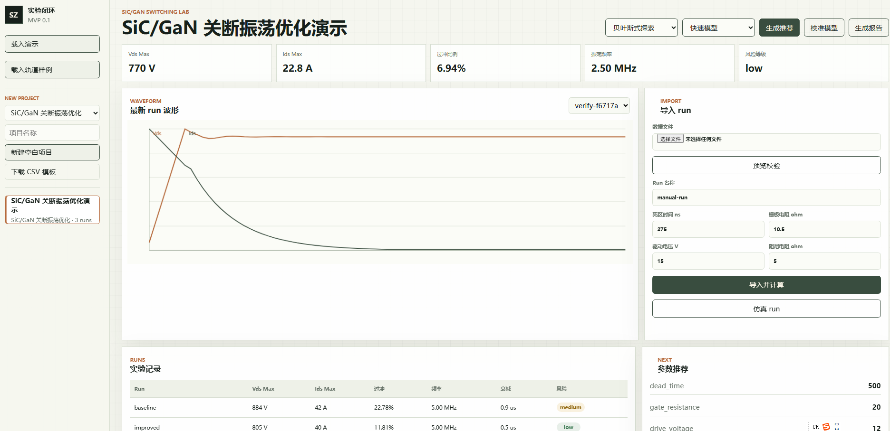

# 实验室自适应优化验证平台 MVP

这是根据 `MVP_PRD.md` 和 `TECH_PLAN.md` 启动的第一版本地原型。当前版本聚焦 SiC/GaN 关断振荡优化闭环。



## 当前能力

- 一键载入 SiC/GaN 演示项目。
- 一键载入轨道绝缘检测演示项目，验证第二实验类型插件。
- 导入 CSV / JSON 波形数据。
- 自动提取 Vds 峰值、Ids 峰值、过冲比例、振荡频率、衰减时间、开关损耗估计和风险等级。
- 自动提取轨道绝缘电阻、泄漏电流、环境压力和风险等级。
- 基于历史 run 生成下一组参数推荐。
- 对推荐参数执行安全约束检查。
- 编辑参数空间、安全阈值和优化目标权重，并生成配置版本。
- 在启发式规则和贝叶斯式小样本探索之间切换。
- 在工作台查看每个实验类型的插件 manifest，包括信号、参数、指标、插件实现和安全契约。
- 从 manifest 自动创建空白项目。
- 下载当前实验类型的 CSV 数据模板。
- 导入 run 前预览数据字段、缺失字段、额外字段、行数和前几行内容。
- 在导入预览阶段手动映射非标准字段名，例如 `V_DS` -> `vds`。
- 自动记录项目创建、配置更新、数据导入、run 完成、推荐生成和报告生成日志。
- 通过数字孪生模型插件直接生成仿真 run，并复用指标、推荐、安全检查和报告链路。
- 支持快速/高保真两种轻量数字孪生模式。
- 推荐参数可以一键送入数字孪生仿真验证。
- 支持基于最新导入 run 的在线模型校准。
- 提供插件目录，展示数据源、预处理、模型、特征、约束、优化和报告插件。
- 生成 HTML 实验报告。
- 提供本地 Web 工作台。

## 启动

```powershell
python .\app.py
```

打开：

```text
http://127.0.0.1:8765
```

进入页面后点击“载入演示”，系统会自动创建 SiC/GaN 项目、导入两组样例数据、计算指标、生成推荐和报告。

点击“载入轨道样例”会创建轨道绝缘检测项目，并复用同一条实验编排流程。

侧栏也可以直接选择实验类型，新建空白项目，或下载该实验类型的 CSV 模板。

导入 run 时建议先点击“预览校验”。平台会根据当前项目的实验 manifest 检查字段是否匹配，并展示前几行数据。若文件字段名不标准，可以在预览区手动映射到标准信号后重新校验。

没有真实数据时，可以直接调整参数后点击“仿真 run”。系统会使用当前实验类型的轻量数字孪生模型生成一条模拟 run。

生成推荐后，可以在推荐卡片中点击“仿真验证推荐”，把推荐参数直接送入当前模型模式。导入真实数据后，也可以点击“校准模型”，系统会用最新导入 run 与轻量模型的差异生成校准系数。

## 测试

```powershell
python -m unittest discover -s tests
```

## 数据格式

CSV 至少需要以下字段：

SiC/GaN：

```text
time,vgs,vds,ids
```

轨道绝缘：

```text
time,voltage,current
```

可选字段：

```text
temperature,humidity
```

样例数据在 `sample_data/` 目录中。

## 目录结构

```text
app.py                  本地 HTTP 服务入口
src/lab_mvp/            后端核心模块
static/                 前端工作台
sample_data/            SiC/GaN 样例数据
data/                   本地运行数据和报告
tests/                  单元测试
```

## 下一步

- 增加真实 SPICE / Simscape 适配器。
- 增加 HDF5 解析支持。
- 增加事件日志筛选、导出和权限控制。
