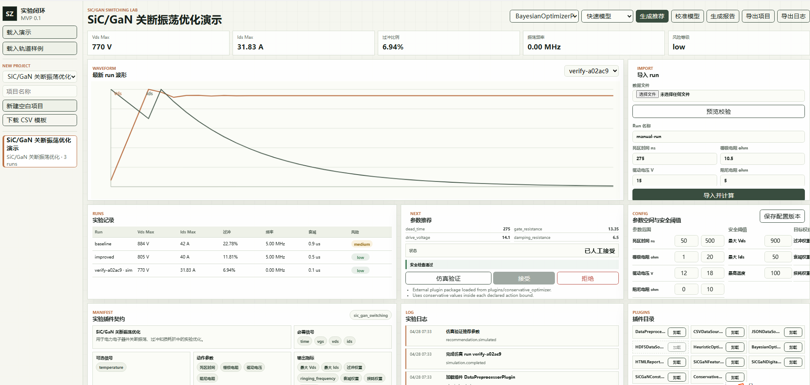

# 实验室自适应优化验证平台 MVP

这是一个本地可运行的实验室自适应优化验证平台原型，围绕 `szns.md` 中的模块化、插件化、闭环验证思路实现。当前版本不依赖外部服务，使用 Python 标准库后端和原生 HTML/CSS/JS 前端，适合快速验证实验类型接入、数据导入、指标提取、优化推荐、仿真验证、插件管理和报告导出流程。



## 当前能力

- 支持 SiC/GaN 开关振荡优化和轨道绝缘检测两类实验插件。
- 通过 manifest 定义每类实验的信号、参数、指标、插件实现和安全契约。
- 支持 CSV / JSON 数据导入，HDF5 作为可选数据源适配器接入。
- 支持按实验类型下载 CSV 模板。
- 导入前可预览数据字段、缺失字段、额外字段、前几行内容和数据质量摘要。
- 支持字段别名自动映射和手动字段映射，例如 `V_DS` -> `vds`。
- 内置数据预处理插件，输出异常数量、噪声指数和信号统计。
- 内置 SiC/GaN 与轨道绝缘特征提取插件。
- 内置 SiC/GaN 与轨道绝缘安全约束插件。
- 内置启发式优化器和轻量贝叶斯式小样本搜索优化器。
- 内置轻量数字孪生插件，支持 `fast` 与 `high_fidelity` 两种模式。
- 可直接基于当前参数生成仿真 run，并复用同一套指标、约束、推荐和报告链路。
- 推荐参数可一键送入数字孪生仿真验证。
- 推荐结果支持人工接受 / 拒绝，并记录事件日志。
- 支持基于最新真实导入 run 的在线模型校准，并生成新的配置版本。
- 可编辑参数空间、安全阈值和目标权重。
- 自动记录项目创建、配置更新、数据导入、run 完成、仿真完成、推荐生成、推荐决策、模型校准和报告生成事件。
- 支持 HTML 实验报告生成，报告内含"打印为 PDF"按钮，点击后调用浏览器打印对话框。
- 支持项目 JSON 导出和事件日志 CSV 导出。
- 前端提供插件目录，可查看数据源、预处理、模型、特征、约束、优化和报告插件状态。
- 支持对已注册插件进行运行时加载 / 卸载，状态持久化到本地 store；卸载后相关流程会阻断并提示重新加载。
- 支持扫描 `plugins/<package>/plugin.json + plugin.py` 外部插件包；外部包支持 `optimizer`、`feature`、`model`、`constraint`、`report`、`data_source` 六种类型。
- `feature` 类型外部插件采用追加合并模式，新增指标字段不会替换内置特征提取结果。
- 已提供 4 种类型外部插件样例：`conservative_optimizer`（optimizer）、`sic_gan_rms_feature`（feature）、`track_aging_model`（model）、`csv_report`（report）。
- 支持通过"重新扫描"按钮（`POST /api/plugins/reload`）热重载外部插件，无需重启服务器。
- 提供 CLI 插件校验工具，可在提交插件包前验证接口合规：`python -m lab_mvp.plugins validate plugins/<package>` 或 `python -m lab_mvp.plugins list plugins/`。
- 前端工作台采用单屏仪表盘布局，config / manifest / 事件日志 / 插件目录四个面板支持折叠，折叠状态持久化到本地存储。
- 优化器下拉框会根据当前已加载的优化器插件动态生成。

## 启动

```bash
bash scripts/start.sh
```

停止：

```bash
bash scripts/stop.sh
```

打开：

```text
http://127.0.0.1:8765
```

进入页面后可以点击"载入演示"创建 SiC/GaN 项目，或点击"载入轨道样例"创建轨道绝缘检测项目。侧栏也可以选择实验类型，新建空白项目，并下载对应的 CSV 数据模板。

导入 run 时建议先点击"预览校验"。平台会根据当前项目的实验 manifest 检查字段是否匹配，并展示前几行数据。没有真实数据时，可以直接调整参数后点击"仿真 run"生成模拟实验记录。

插件目录中的"加载 / 卸载"按钮会实时改变插件状态。卸载后的插件不会参与对应流程，例如卸载某个优化器后，它会从优化器下拉框中移除；如果 API 直接调用该插件，也会返回需要重新加载的提示。点击"重新扫描"可以无需重启服务器地重新发现 `plugins/` 目录下新增或更新的外部插件包。

## HDF5 说明

HDF5 支持是可选适配器：当前环境需要安装 `h5py` 才能解析 `.h5` / `.hdf5` 文件。未安装时，平台会在预览阶段返回清晰错误，不影响 CSV / JSON 主流程。

当前 HDF5 适配器支持两种简单结构：

- 根节点或子节点中存在同长度的一维数值数据集，例如 `time`、`vds`、`ids`。
- 二维表格数据集，并在 `columns` 属性中提供列名。

## 外部插件格式

外部插件以目录为单位放在 `plugins/` 下：

```text
plugins/
  conservative_optimizer/
    plugin.json
    plugin.py
```

`plugin.json` 必填字段：`id`、`name`、`type`、`entrypoint`。

| 字段 | 说明 |
| --- | --- |
| `type` | 插件类型，见下表 |
| `entrypoint` | `模块名:类名`，例如 `plugin:MyPlugin` |
| `experiment_type` | 可选，`feature` / `model` / `constraint` 类型需要指定 |
| `file_extensions` | 可选，`data_source` 类型需要指定，例如 `[".tsv", ".dat"]` |
| `key` | 可选，优化器类型会作为下拉框的 value |
| `default_loaded` | 可选，默认 `true` |

支持的插件类型及入口类需要实现的方法：

| 类型 | 必须方法 |
| --- | --- |
| `optimizer` | `recommend(runs, config) -> dict` |
| `feature` | `extract(rows, config) -> dict` |
| `model` | `simulate(parameters, config, mode) -> list[dict]` |
| `constraint` | `check(recommendation, config) -> dict` |
| `report` | `generate(project, runs, recommendations, config, manifest, events) -> str` |
| `data_source` | `load_text(content, signals, field_mapping) -> list[dict]`<br>`preview_text(content, ...) -> dict` |

`optimizer` 示例：

```json
{
  "id": "optimizer:ConservativeOptimizerPlugin",
  "name": "ConservativeOptimizerPlugin",
  "type": "optimizer",
  "key": "conservative_external",
  "version": "0.1.0",
  "entrypoint": "plugin:ConservativeOptimizerPlugin",
  "default_loaded": true
}
```

```python
class ConservativeOptimizerPlugin:
    name = "ConservativeOptimizerPlugin"

    def recommend(self, runs: list[dict], config: dict) -> dict:
        return {
            "recommended_parameters": {},
            "expected_improvement": {},
            "optimizer": self.name,
            "reasons": []
        }
```

新增插件包后，点击工作台插件目录中的"重新扫描"按钮即可加载，无需重启服务器。

## CLI 插件校验工具

在提交新插件包之前，可以先用 CLI 工具校验格式和接口合规性：

```bash
# 校验单个插件包
uv run python -m lab_mvp.plugins validate plugins/my_plugin

# 扫描 plugins/ 目录下所有包
uv run python -m lab_mvp.plugins list plugins/
```

校验项包括：`plugin.json` 必填字段（`id`、`name`、`type`、`entrypoint`）、插件类型是否受支持、entrypoint 模块文件是否存在、插件实例是否实现了所有必须方法、类型特定的建议（如 `data_source` 缺少 `file_extensions` 时会给出警告）。

## 测试

```bash
bash scripts/test.sh
```

当前共 55 条测试（27 核心闭环 + 28 插件样例与 CLI 工具）。测试日志输出到 `logs/test.log`。

当前单元测试覆盖核心闭环、双实验类型、数据预览、字段映射、数字孪生、推荐仿真、模型校准、插件目录、动态加载 / 卸载、外部插件包扫描、推荐人工决策、项目导出、事件导出和 HDF5 可选适配器，共 27 条。

## 数据格式

SiC/GaN CSV 至少需要：

```text
time,vgs,vds,ids
```

轨道绝缘 CSV 至少需要：

```text
time,voltage,current
```

常用可选字段：

```text
temperature,humidity
```

样例数据位于 `sample_data/`。

## 目录结构

```text
app.py                  本地 HTTP 服务入口
src/lab_mvp/            后端核心模块
static/                 前端工作台
plugins/                外部插件包目录
sample_data/            样例数据
data/                   本地运行数据和报告
logs/                   运行日志（server.log、test.log）
scripts/                启停与测试脚本
tests/                  单元测试
```

## 边界

本 MVP 已完成本地注册插件的运行时加载 / 卸载、全类型外部插件包扫描与热重载，但真实 SPICE / Simscape、真实设备采集、PDF 后端生成、权限控制和社区插件市场仍是可接入位置，没有绑定具体商业软件或硬件运行时。后续接真实实验环境时，优先新增对应数据源插件、数字孪生插件和权限层，而不是改动核心编排流程。
